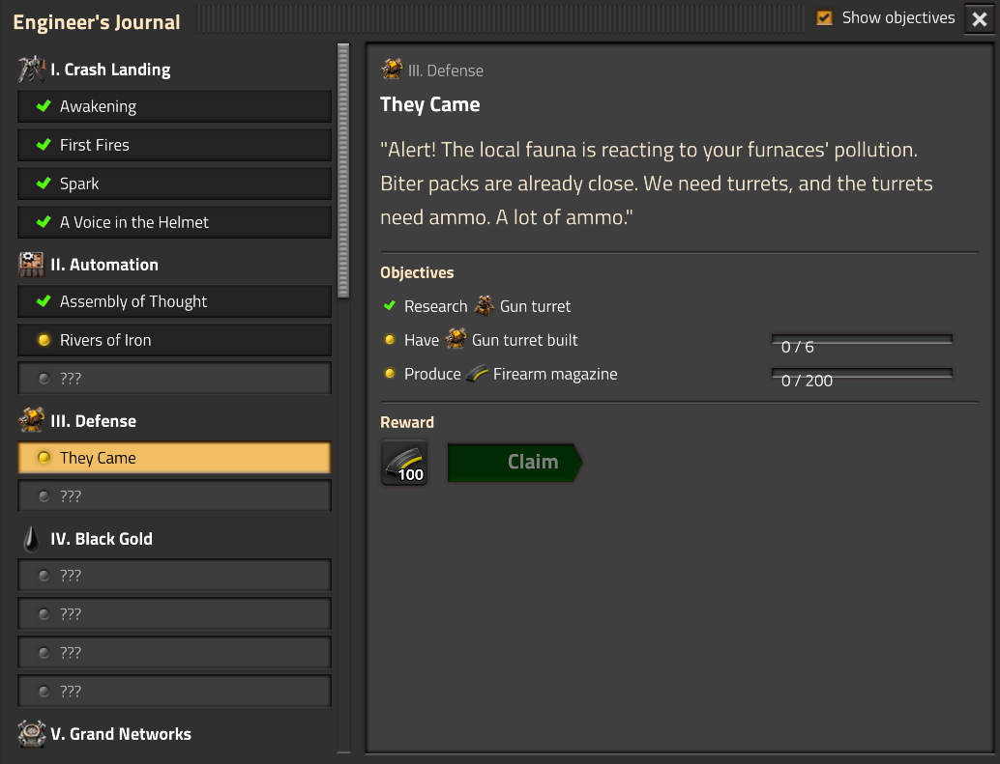
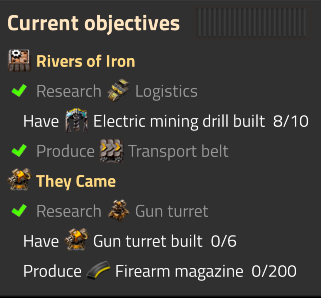
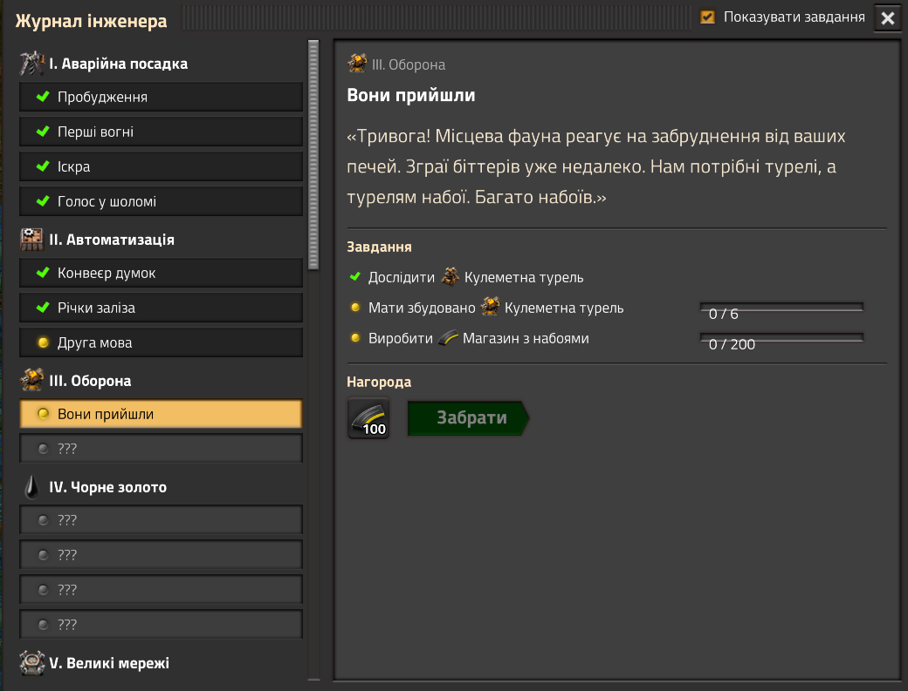
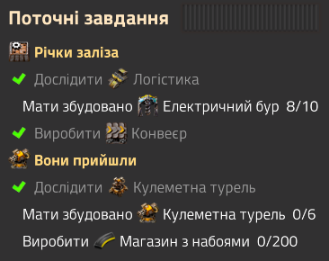

# Quest Book

**English** · [Українська](#українська)

An in-game story journal for Factorio 2.0. Not sure what to do next? 37 story quests guide you from the crash landing on Nauvis to the edge of the solar system.



## Features

- **13 chapters, 37 quests:** crash landing, automation, defense, oil, trains and robots, every science pack, the rocket. With Space Age: orbit, Vulcanus, Fulgora, Gleba, Aquilo and the edge of the system.
- **Branching progression.** Defense runs alongside automation; the inner planets can be visited in any order.
- **Small rewards** for some quests, claimed by each player individually.
- **Vanilla and Space Age.** Quests that need content you don't have are skipped automatically.
- **Multiplayer:** progress is shared per force.
- **Languages:** English, Ukrainian, German.



## Usage

| Action | How |
| --- | --- |
| Open / close the journal | `Shift + J`, the book button in the top-left corner, or the shortcut bar |
| Open a quest from the tracker | Click its title |
| Hide the tracker | Untick *Show objectives* in the journal |
| Claim a reward | Open the completed quest and press *Claim* |

The key can be rebound in *Settings → Controls → Mods*.

## Compatibility

- Factorio **2.0**, with or without **Space Age**.
- Total-overhaul modpacks (Space Exploration, Krastorio 2 and similar) are not supported. The mod will load, but the story is written for the vanilla progression.
- Safe to add to an existing save: quests you have already satisfied complete on their own within a second.

## Admin commands

| Command | Effect |
| --- | --- |
| `/qb-complete` | Complete all active quests |
| `/qb-complete <id>` | Complete one quest by id (ids are in `scripts/quests.lua`) |
| `/qb-reset` | Reset quest progress and claimed rewards for your force |

## For mod authors

The mod exposes a remote interface:

```lua
-- { [quest id] = "done" | "active" | "locked" | "skipped" }
remote.call("quest-book", "get_status", "player")

-- Run a progress check immediately; returns true if any quest was completed
remote.call("quest-book", "check", "player")
```

## Contributing

Quests are plain data in [`scripts/quests.lua`](scripts/quests.lua); texts are in `locale/<language>/quest-book.cfg`.

- **New quest:** add an entry to `scripts/quests.lua` and its title and story to every locale.
- **Translation:** copy `locale/en` to `locale/<code>` and translate the values. The keys must stay the same.
- **Never rename a quest `id`** in a released version: player progress is stored by id.

Supported objective types: `produce`, `research`, `build`, `rocket`, `visit`, `reach`. See the comment at the top of `scripts/quests.lua`.

Bug reports and ideas are welcome in Issues or in the mod portal discussion.

## Credits

Thanks to everyone who translated the mod:

- **German:** [Yokmp](https://github.com/Yokmp) and Eddy_Karacho

## License

MIT

---

# Українська

Сюжетний журнал прямо в грі для Factorio 2.0. Не знаєте, що робити далі? 37 сюжетних квестів ведуть від аварійної посадки на Наувіс до краю Сонячної системи.



## Можливості

- **13 розділів, 37 квестів:** аварійна посадка, автоматизація, оборона, нафта, потяги й роботи, усі наукові колби, ракета. Зі Space Age: орбіта, Вулкан, Фульгора, Глеба, Аквіло і край системи.
- **Розгалуження.** Оборону можна будувати разом з автоматизацією, а внутрішні планети проходити в будь-якому порядку.
- **Невеликі нагороди** за деякі квести. Кожен гравець забирає свою.
- **Ваніль і Space Age.** Квести, для яких немає потрібного контенту, пропускаються автоматично.
- **Мультиплеєр:** прогрес спільний для всієї команди (force).
- **Мови:** українська, англійська, німецька.



## Як користуватися

| Дія | Як |
| --- | --- |
| Відкрити або закрити журнал | `Shift + J`, кнопка-книга вгорі зліва або панель ярликів |
| Відкрити квест з панелі | Клікнути по назві |
| Сховати панель завдань | Зняти прапорець *Показувати завдання* у журналі |
| Забрати нагороду | Відкрити виконаний квест і натиснути *Забрати* |

Клавішу можна змінити в *Налаштування → Керування → Моди*.

## Сумісність

- Factorio **2.0**, зі **Space Age** або без нього.
- Великі збірки, що переробляють усю гру (Space Exploration, Krastorio 2 тощо), не підтримуються. Мод завантажиться, але сюжет написано під ванільну прогресію.
- Можна додати в наявне збереження: квести, які ви вже виконали, зарахуються самі протягом секунди.

## Команди адміністратора

| Команда | Дія |
| --- | --- |
| `/qb-complete` | Завершити всі активні квести |
| `/qb-complete <id>` | Завершити один квест за id (id є в `scripts/quests.lua`) |
| `/qb-reset` | Скинути прогрес і отримані нагороди своєї команди |

## Як долучитися

Квести описані даними у [`scripts/quests.lua`](scripts/quests.lua), тексти лежать у `locale/<мова>/quest-book.cfg`.

- **Новий квест:** додати запис у `scripts/quests.lua`, а його назву й історію в кожну локаль.
- **Переклад:** скопіювати `locale/en` у `locale/<код>` і перекласти значення. Ключі мають лишитися ті самі.
- **Не перейменовувати `id` квестів** у вже опублікованій версії, бо прогрес гравців зберігається за id.

Про баги та ідеї пишіть в Issues або в обговоренні на порталі модів.

## Подяки

Дякую всім, хто переклав мод:

- **Німецька:** [Yokmp](https://github.com/Yokmp) та Eddy_Karacho

## Ліцензія

MIT
